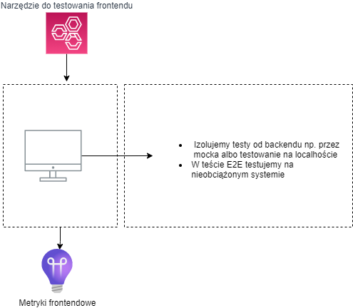
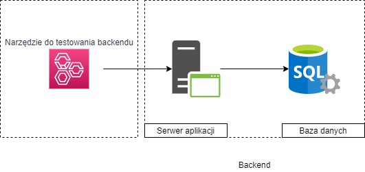
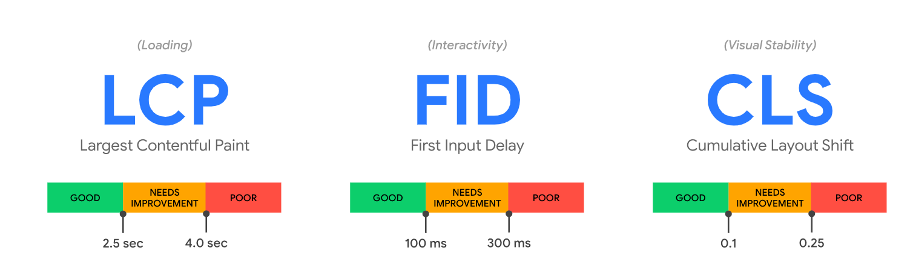
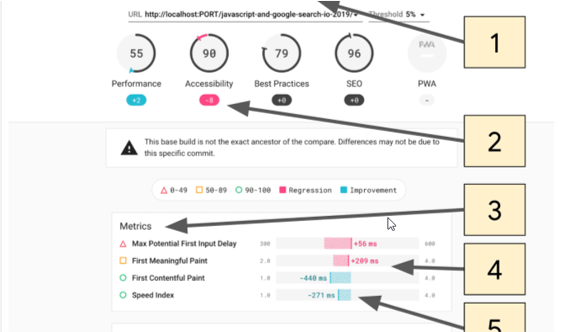

# Rodzaje testów wydajnościowych i nomenklatura

## AUT(application under test, system under test) - model warstwowy aplikacji

Aplikacje w szczególności webowe można opisać jako składające się z frontendu i backendu. Czasami spotkamy się z modelem warstwowym gdzie wyróżniamy warstwę prezentacji, logiki i danych.
Frontend (to co wyświetla przeglądarka, aplikacja desktopowa) testuje się inaczej niż backend (serwer aplikacji, api, baza). Ważne są inne metryki, mamy do czynienia z innym podejściem.
Najprościej myśleć o frontendzie jako czymś co prezentuje rezultaty otrzymane z backendu i pozwala nam wchodzić w interakcje z systemem. Backend generuje rezultaty w odpowiedzi na żądania z frontendu, które są konsekwencją
akcji użytkownika np. kliknięcia w przycisk. Frontend jest dla użytkownika a z  backendem powinny "rozmawiać" programy. W świecie aplikacji webowych frontend top strona w przeglądarce a backend to np. API serwer i baza MySQL.

> Nasze szkolenie odbywa się w kontekście testowania backendu aplikacji webowych. 
 

    `źródło: Gabriel Starczewski`

Pytanie:

- Jakie znacie przykłady serwera aplikacji?
- Jakie znacie bazy danych?
- Jakie technologie frontendowe znacie? Co może być frontendem ?

***
## Złota zasada wydajności - _Performance Golden Rule_

> 80-90% of the end-user response time is spent on the frontend. Start There.
>
> [Steve Souders, Google’s Head Performance Engineer, 2007](http://www.stevesouders.com/blog/2012/02/10/the-performance-golden-rule/)

Czas odpowiedzi całego systemu na żądanie użytkownika dzielimy na:
- czas związany z backendem = TTFB (Time To First Byte)
- czas związany z frontendem = cala reszta

Tak wyglądają proporcje tych dwóch składników dla 50 000 reprezentatywnych stron z [HTTP Archive](http://httparchive.org/).

`źrodło: https://www.stevesouders.com/blog/2012/02/10/the-performance-golden-rule/`

## frontend vs backend
Czym się różnią testy frontendu i backendu?

1) Wydajność frontendu w zasadzie się nie zmienia jeśli z systemu korzysta wielu użytkowników i jest podobna dla każdego użytkownika ponieważ np. przeglądarki dwóch osób nie mają ze sobą nic wspólnego
2) Powyższe stwierdzenie jest prawdziwe o ile backend odpowiada na czas dlatego testując sam frontend często backend mockujemy (udajemy) i zakładamy, że nie jest on problemem.
3) W testowaniu i optymalizacji frontendu zajmujemy się więc tym co jest związane jedynie z nim.
4) W przypadku backendu, skupiamy się na symulowaniu obciążenia - wielu użytkowników, tutaj liczba użytkowników/klientów ma znaczenie bo liczba żądań od użytkowników to jeden z głównych czynników obciążających backend.
5) Nie ma natomiast znaczenia jaką kto ma przeglądarkę, co generuje żądanie, liczy się tylko to ile jest ich w czasie.
6) Dodatkowo testując backend nie renderujemy stron WWW, pomijamy więc interpretację JavaScriptu
7) Frontend możemy testować również E2E (end-to-end) czyli z prawdziwym systemem pod prawdziwym lub syntetycznym obciążeniem. Oprócz tego używa się również RUM (Real User Monitoring) do analizy pasywnej.

***
### frontend testing

Zadanie:

1. Otwórz plik zawierający [sam frontend](assets/index1.html) w przeglądarce. Z czego się składa ?
2. Otwórz plik zawierający [frontend komunkujący się z backendem](assets/index2.html) w przeglądarce. Z czego się składa ? Co jest backendem? Zobacz co się dzieje w ChromeDevTools/Network

Jakie czynniki mają najczęściej wpływ na wydajnośc frontendu ?

- połączenie sieciowe
- rodzaj klienta (PC, Smartphone)
- parametry klienta np. CPU, karta graficzna, pamięć
- na ogół wydajnośc frontendu badamy z perspektywy jednego użytkownika w izolacji od backendu lub z nieobciążonym backendem

***
### backend testing

Podczas testowania backendu symulujemy/zastępujemy naszych użytkowników narzędziem. 

Jakie czynniki mają najczęściej wpływ na wydajność backendu ?

- liczba równoległych sesji, żądań, zadań
- wolumen danych w backendzie np. w bazie danych
- parametry maszyn obsługujących ruch. np liczba i moc CPU, ilość pamięci RAM. szybkość dysku i operacji I/O
- w przypadku chmur parametry usługi np. abstrakcyjne jednostki obliczeniowe ACU, DTU, ... 
- wydajność backendu testujemy zastępując prawdziwych klientów (przeglądarki, etc.) odpowiednim narzędziem np. JMeter

***
### lighhouse metrics

**Zadanie**:
- Otwórz konsolę Chrome Web Tools
- Wykonaj audyt jednej z naszych aplikacji : https://red-water-022d04b03.azurestaticapps.net/
- Zapoznaj się z metrykami

Core Web Vitals

`żrodło: https://web.dev/vitals/`

Google ogłosił, że Core Web Vitals będą miały wpływ na pozycjonowanie strony od maja 2021.

`żrodło: https://developers.google.com/search/blog/2020/11/timing-for-page-experience`

Links:
- https://github.com/GoogleChrome/web-vitals

***
### lighhouse Ci server metrics

