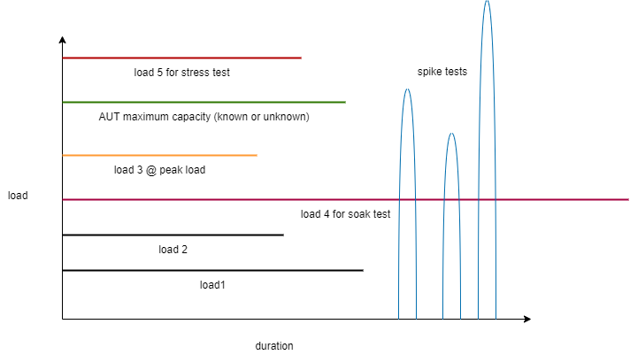

# Rodzaje testów wydajnościowych i nomenklatura

## Rodzaje testów

Niestety nomenklatura nie jest spójna w tym zakresie. 

`żrodło: Gabriel Starczewski`

Proponowane definicje przez autora:
### load testy (testy obciążeniowe)

Testowanie aplikacji pod określonym obciążeniem (load) n.p.: 100 sesji na minutę, 50 requestów na sekundę.
System możemy testować wielokrotnie zmieniając obciążenie (load), żeby np znaleźć maksymalne obciążenie, z którym system sobie poradzi (maximum capacity testing).

**Pytanie**:
- Co może być miarą obciążenia ?

### peak load testy (testy z maksymalnym spodziewanym obciążeniem)

Testujemy z maksymalnym obciążeniem, pod którym wiemy, że system będzie pracował  n.p.: 200 sesji na minutę, 100 requestów na sekundę.

**Pytanie**:
- Skąd wiemy jakie to maksymalne obciążenie jest?

### maximum, capacity testy (testy maksymalnej przepustowości/pojemności)

Testujemy z wieloma obciążeniami, zwiększając je. Maksymalne obciążenie, pod którym nasze wymagania niefunkcjonalne są spełnione to nasza maksymalna przepustowość.
ten rodzaj testów ma za zadanie znaleźć maksimum naszej aplikacji.

**Pytanie**:
- Wymaganie niefunkcjonalne 1: 
  -  System nie może zwracać więcej niż 1 błąd na 10 000 requestów dla danej liczby równoległych sesji.

- Jak znaleźć nasze maksimum?

### stress testy (testy przeciążeniowe)

Tutaj testujemy pod obciążeniem (zdecydowanie większym) niż nasze maksimum. Chcemy zobaczyć czy system jest w stanie wrócić do poprawnego stanu po przeciążeniu,
jakie skutki ma przeciążenie systemu, czy procedure autoskalowania działają, etc...

### soak testy (testy przesączeniowe)

Testujemy aplikację pod średnim obciążeniem np. 60% naszego maksimum ale w długim okresie czasu. Ten rodzaj testów ma za zadanie obnażyć problemy aplikacji z zarządzaniem zasobami np:
przepełnienie dysku, pamięci, ...

### spike testy

Testujemy aplikację symulując gwałtowny wzrost obciążenia. Docelowa wartość obciążenia może być mniejsza lub większa od naszego maksimum. Sprawdzamy czy aplikacja
poradzi sobie z taką sytuacją.

**Pytanie**:
- W jakich rodzajach aplikacji mają miejsce takie wzorce ruchu ?
- Jakie zdarzenia powodują takie wzorce ruchu?

### Inne rodzaje testów związanych z wydajnością, Czy mówią Ci coś ?
- testy A/B (testy porównawcze)
- chaos engineering attacks/(d)dos
- reliability testing (testy niezawodności)
- recovery testing

**Zadanie**:

>Wymaganie 1: 95% czasów odpowiedzi API < 4s
>
>Wymaganie 2: Maksymalna oczekiwana liczba użytkowników na minutę 180.

- Test: 
    -   Miara obciążenia:
        - Liczba użytkowników na minutę
        
Jaką możemy zaproponować strategię testów zawierającą większość rodzajów testów z tych, które poznaliśmy?
Jak mogłaby wyglądać realizacja takiej strategii?