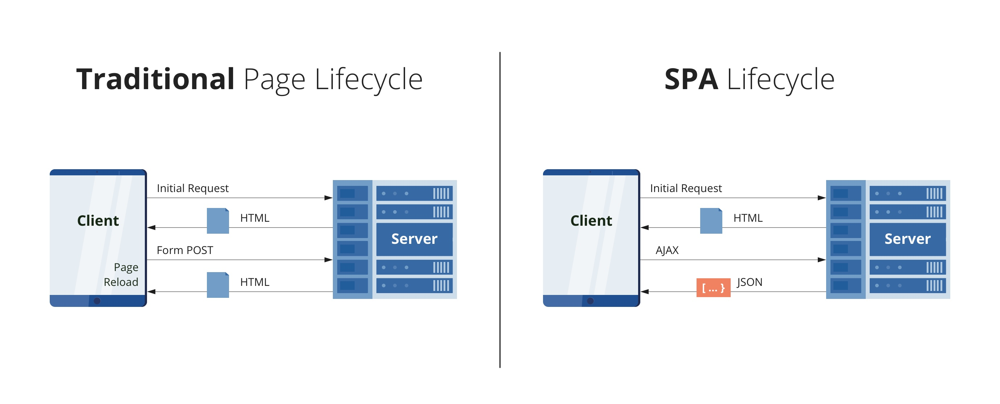

# Rodzaje AUT (Application-Under-Test): SPA, MPA, API

***

Najczęściej spotykane rodzaje AUT to SPA, MPA, API. ... Co to znaczy?

``żródło: https://dzone.com/articles/the-comparison-of-single-page-and-multi-page-appli``

## MPA (Multi Page Application; aplikacje tradycyjne)

W aplikacjach typu MPA każda nowa strona powoduje wysłanie do serwera żądania o dokument HTML, który powoduje przeładowanie
kompletnej strony w przeglądarce.

**Zadanie:** 
- Załadujcie do przeglądarki [aplikację mpa](../003_aut/mpa/index.html)
- Zobaczcie co się dzieje w Network Tab w panelu Chrome Dev Tools
 

***
## SPA (Single Page Application)

W aplikacjach typu SPA, tylko pierwsze żądanie jest o stronę HTML. Kolejne są już na ogół wysyłane przez frontend/javascript
z wykorzystaniem: FETCH, HTTPRequest (AJAX) i najczęściej powodują tylko częściowe zaktualizowanie strony bez potrzeby pełnego przeładowania. Odpowiada za to javascript.

**Zadanie:**
- Załadujcie do przeglądarki [aplikację spa](../003_aut/spa/index2.html)
- Zobaczcie co się dzieje w Network Tab w panelu Chrome Dev Tools
 

***
## API (Application Programing Interface)

API to najczęściej nasz backend. W nowoczesnych systemach aplikacje SPA kontaktują się z API poprzez metody FETCH i AJAX w celu pobrania danych i użycia ich do aktualizacji frontendu.

**Zadanie:**
- Zapoznajcie się z [backendem, który będziemy testować](../003_aut/api/app/)
- Czy jesteście w stanie powiedzieć jakie API endpointy się tu znajdują i do czego służą?

## A teraz zapoznajmy się z twarzą naszej aplikacji :)

Backend już poznaliście. Czas na frontend.
- Załadujcie do przeglądarki [frontend aplikacji, którą będziemy testować](../003_aut/full/)
- Zapoznajcie się z zawartością Network Tab w Chrome Dev Tools.  
- Zanalizujcie zawartość aplikacji frontendowej.