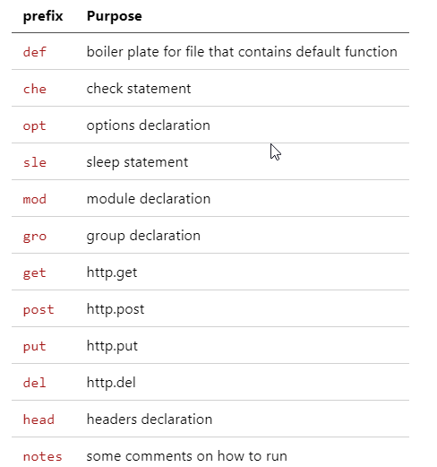

# Instalacja

W tej części zainstalujemy k6 oraz spojrzymy na CLI do k6. Uruchomimy k6 z poziomu CLI, dockera i IDE.

W systemie k6 [można zainstalować](https://k6.io/docs/getting-started/installation/):

- z paczki systemowej dla systemu operacyjmego (np .msi)
- użyć dockera 
- dodatkowo w azure istnieje dedykowamy task 'k6' do pipelinów

My, zainstalujemy k6 z paczki .msi a następnie wybróbujemy podstawowe polecenia CLI:
***

## CLI
Podstawowe polecenia w CLI:

```powershell
    k6
    k6 archive --help
    k6 help inspect
    k6 run script.js
    k6 run --vus 10 --duration 30s script.js
    k6 archive -u 10 -d 10s -O script.tar script.js
    k6 run .\script.tar
    k6 inspect .\script.tar
    k6 run --http-debug --vus 10 --duration 30s script.js
    k6 run --http-debug=full --vus 10 --duration 30s script.js
    k6 status
    k6 stats
    k6 --help
    k6 version
    (..)
```

Polecenia pause, resume, scale poznamy w dalszej części szkolenia - https://k6.io/blog/how-to-control-a-live-k6-test/


## IDE
***
Zainstalujemy plugin do [IDE Intellij Enterprise edition (wersja 2021.1.3).](https://plugins.jetbrains.com/plugin/16141-k6/versions)

Alternatywnie zainstalujcie plugin dla swojego IDE pierwszego wyboru. Np dla VS code warto zainstalować:
- k6 for Visual Studio Code (Ctrl-Shift-P -> k6 )
- k6 snippets
Skonfigurujemy też kombinację klawiszy do uruchomienia testu - Ctrl-K.



Przetestujemy 'snippety' w pliku vs.js. Użyjemy Ctrl-Shift-P do uruchomienia bieżącego pliku.

Uwaga dla użytkowników JMetera: w k6 zamiast wątka (thread) używa się terminu "Virtual User (VU)".

## Docker
***
```powershell
    cat script.js | docker run -i loadimpact/k6 run -
```