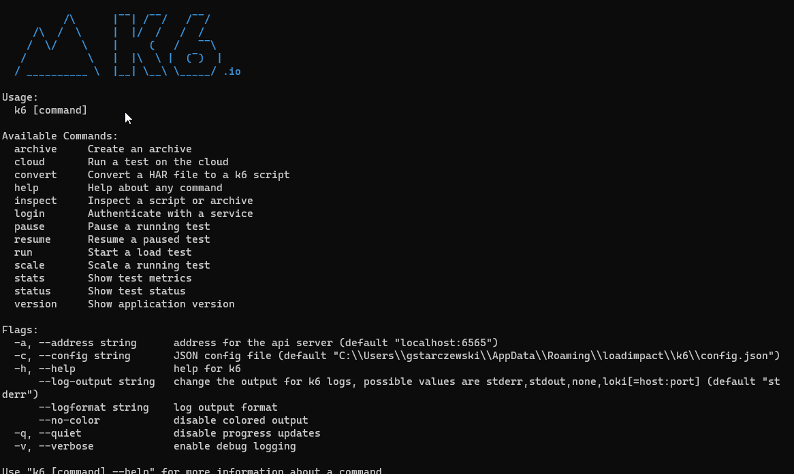

# Instalacja

W tej części zainstalujemy k6 oraz spojrzymy na CLI do k6.

W systemie k6 [można zainstalować](https://k6.io/docs/getting-started/installation/):

- z paczki systemowej dla systemu operacyjmego (np .msi)
- użyć dockera 
- dodatkowo w azure istnieje dedykowamy task 'k6' do pipelinów

My, zainstalujemy k6 z paczki .msi a następnie wybróbujemy podstawowe polecenia CLI:
***

Podstawowe polecenia w CLI:

```powershell
    k6
    k6 help inspect
    k6 run script.js
    k6 run --vus 10 --duration 30s script.js
    k6 run --http-debug --vus 10 --duration 30s script.js
    k6 --help
```



***
Zainstalujemy plugin do [IDE Intellij Enterprise edition (wersja 2021.1.3).](https://plugins.jetbrains.com/plugin/16141-k6/versions)
Alternatywnie zainstalujcie plugin dla swojego IDE pierwszego wyboru.

W k6 zamiast wątka (thread) używa się terminu "Virtual User (VU)".