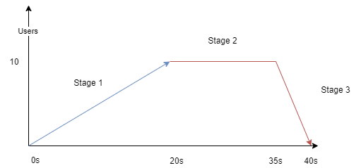

# Thresholds, Options


Plikiem początkowym do tego ćwiczenia jest __04_thresholds.js__

### (1/1) Opcje: 

Jest to zadanie na symulacje ruchu. Spraw by Twój test rozpędzał sie powoli, użyj [stage'y](https://k6.io/docs/using-k6/options/#stages) any zasymulować taki wzorzec obciążenia. Stage są "skrótem" dla bardziej zaawansowanych konfiguracji opartych o scenariusze.



- 0-20s -> wzrost od 0 VU do 10 VU
- 20-35s -> 10 VU przez cały czas
- 35-40s -> spadek do 0 VU

Sprawdż jak się zmienił output testu.

### (1/2) Thresholdy (Progi)

Zdefiniuj Quality Gate (oczekiwanie, próg) następująco:
- średni czas trwania grupy 'Log Out' powinien być mniejszy niż 10ms 

Żeby zdefiniować warunek będziesz potrzebował pełnego selektora grupy 'Log Out', do której chcesz się odwołać, możesz użyć polecenia:

```powershell
     k6 run --iterations=10 .\04_thresholds.js --out csv
```
aby ją odczytać z pliku csv, który zostanie wygenerowany. Użyj dokumentacji i gotowych przykładów ze strony k6 aby zrealizować ćwiczenie