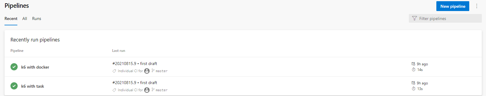

#Azure Pipelines

Aby puszczać testy [k6 z poziomu Azure DevOps](https://k6.io/blog/integrating-load-testing-with-azure-pipelines/#:~:text=k6%20is%20a%20free%20and,APIs%2C%20microservices%2C%20and%20websites.&text=It%20can%20be%20used%20to,configured%20through%20code%20and%20markup.
) mamy do dyspozycji następujące opcje:
- instalacje systemową (podobnie jak na lokalnej maszynie)
- obraz dockerowy
- [task 'k6'](https://marketplace.visualstudio.com/items?itemName=k6.k6-load-test
  ), który możemy zainstalować z azure marketplace

W tej części

