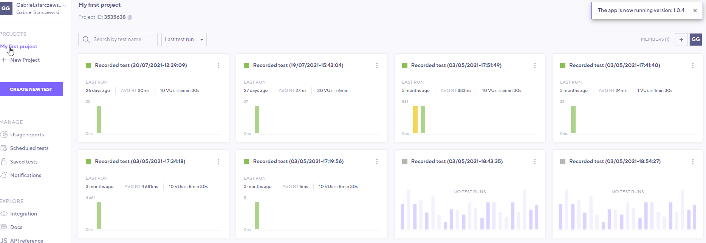

# Nagrywanie (record-correlate-replay)

Do nagrywania użyjemy pluginu [k6 Browser Recorder](https://chrome.google.com/webstore/search/k6) dla Chrome'a. Będzie nam równiez potrzebne konto w k6 Cloud. Możecie do zalogowania wykorzystać konto na Gicie.

Plugin do nagrywania tworzy plik .HAR, które następnie zostaje przesłany do `k6 Cloud` i zaimportowany do Test Buildera:
- w postaci skryptu i kodu JS lub
- do edytora wizualnego takiego jak np, w Postmanie

W tej części wejdziemy na stronę https://red-water-022d04b03.azurestaticapps.net/ nagramy kilka akcji użytkownika i wyślemy nagranie do `k6 Cloud. Tam je wstępnie obrobimy.
Następnie odegramy nagrany scenariusz.

Istnieją inne możliwości nagrywania scenariuszy dla k6, wszystko co tworzy plik .HAR może być użyte do tego celu w tym automatyzacji na linii `przeglądarka -> test wydajnościowy`

Nie ma ćwiczenia do tego modułu. Zamiast tego będzie **Hackathon** :)